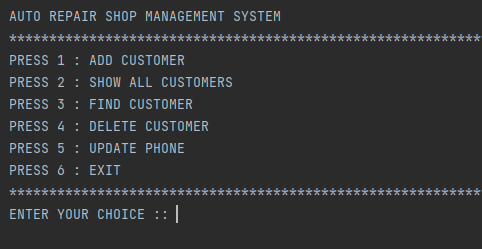

# AUTO-REPAIR-SHOP-JDBC-MINI-PROJECT :star_struck: :nut_and_bolt: :hammer: :date: :credit_card: :computer:

[](https://shields.io/) [](https://shields.io/) [](https://shields.io/) [](https://shields.io/) [](https://shields.io/) [](https://shields.io/)
<BR>

***This new 'Auto Repair Shop Management System' using JDBC is created by Biswarup Bhattacharjee, student of BTECH, in University of Engineering and Management, Kolkata.***

**Email Id: bbiswa471@gmail.com.** 

**Contact No: 916290272740.** 

[](https://www.facebook.com/biswarup.bhattacharjee.5811) [](https://github.com/biswa2210)

## About :point_down: 

<div align="justified">
More than two-third of automotive customers indicate that Service
Convenience is a determining in selecting a brand or purchasing from a Specific 
dealership Consequently, Customer Service and service management is of vital 
relevance to ensure ongoing Customer loyalty and retention and ultimately, 
dealer Profitability.
Auto repair shop Management enables efficient Service order Processing 
designed for any given number of orders per day .It includes Service requests 
and Scheduling Optimization of techicans tools, and parts as well as their 
deployment and scheduling . User friendly interfaces provides ease of use and 
the integration technology ensure a seamless and smooth business. Service 
monitoring and analysis increases the Visibility in Overall fixed Operations and 
helps increases service Capacity utilization efficiency and decreased operating 
cost.
Recreation Vehicle service technician inspect, test, service, and replace every 
system installed in a recreation Vehicle within the particular day.
Both intervals are equally important for properly marinating your Vehicle 
</div>

## Purpose :point_down:

<div align="justified">
  
 A car rental is a system that can be used temporarily for a fee during a specified period. Getting a rental car helps people get around despite the fact they do not have access to their own personal vehicle or don’t own a vehicle at all. The individual who needs a car must contact a rental car company and contact out for a vehicle. This system increases customer retention and simplify vehicle and staff management. 
Aims and Objectives:
 - To produce a Java based database connected (JDBC) software system that allow customer data entry and reserve a particular model of car for a specified period of time and effectively manage their car rental system
 - To ease handling customers rented record.
Benefits it need to provide:
 - The database relational model should be clear enough and easily understood and flexible to use.
 - The software must help in back office administration by streamlining and standardising the procedures.
 - The hourly time slots allocation must be provided.
 - Customer’s authenticity must be kept in mind.
 - Data when required for any particular customer when searched should immediately pop up.
 - The relational schema of the database connected with the project must be easy enough to understand.
 - Repetition of data records must not be entertained.
 - Record handling should be easy. 
 
</div>

## Use :point_down:

<div align="justified">
  
</div>

## Applications :point_down:

<div align="justified">
 Non-functional requirements:-
It describes aspects of the system that are concerned with how the system provides the 
functional requirements. They are:
a. Security:
The subsystem should provide a high level of security and integrity of the data held 
by the system, only authorized personnel of the system can gain access to the 
system’s secured page on the system.
b. Performance and Response Time:
The system should have high performance rate when executing user’s input and 
should be able to provide the response within a short time span usually seconds for 
highly complicated task and 20 to 25 seconds for less complicated task.
c. Error handling:
Error should be considerably minimized and an appropriate error message that 
guides the user to recover from an error should be provided. Validation of user’s 
input is highly essential. Also the standard time taken to recover from an error 
should be 15 to 20 seconds.
d. Availability: 
This system should always be available for access at 24 hours, 7 days a week. Also in 
the occurrence of any major system malfunctioning , the system should be available 
in 1 to 2 working days , so that the business process is not severely affected.
e. Ease of use: 
Considered the level of knowledge possessed by the user of this system , a simple 
but quality user interface should be developed to make it easy to understand and 
required less trainin 
</div>

## Future Scopes :point_down:

<div align="justified">
In a nutshell, it can be summarized that the future scope of the project 
circles around maintaining information regarding :-
 We can add printer in future.
 We can give more advance software for Auto Repair 
Shop Management including more facilities.
 We will host the platform on online servers to make it 
accessible worldwide Integrate multiple load balancers 
to distribute the loads of the system.
 Create the master and slave database structure to 
reduce the overload of the database queries.
 Implement the backup mechanism for taking backup of 
codebase and database on regular basis on different 
servers.
The above mentioned points are the enhancements which can be done 
to increase the applicability and usage of this project. Here we can 
maintain the records of cars. 
Enhancements can be done to maintain all the cars, owners, payments 
etc. We have left all the options open so that if there is any other future 
requirement in the system by the user for the enhancement of the 
system then it is possible to implement them. In the last we would like 
to thanks all the persons involved in the development of the system 
directly or indirectly. We hope that the project will serve its purpose for 
which it is develop there by underlining success of process  
</div>

## Conclusion :point_down:

Our project is only a humble venture to satisfy the needs to manage their 
project work. Several user friendly coding have also adopted. This 
package shall prove to be a powerful package in satisfying all the 
requirements of the auto repair shop. The objective of software planning 
is to provide a frame work that enables the manger to make reasonable 
estimates made within a limited time frame at the beginning of the 
software project and should be updated regularly as the project 
progresses.
The package was designed in such a way that future modifications can 
be done easily. The following conclusions can be deduced from the 
development of the project.
 Automation of the entire system improves the efficiency.
 It provides a friendly graphical user interface which proves to be 
better when compared to the existing system.
 It gives appropriate access to the authorized users depending on 
their permissions
 It effectively overcomes the delay in communications.
 Updating of information becomes so easier.
 System security, data security and reliability are the striking 
features.
 The System has adequate scope for modification in future if it is 
necessary.
Finally, the system is implemented and tested according to test cases
## Folder Structure :point_down:
```bash
AUTO-REPAIR-SHOP-JDBC-MINI-PROJECT
     ├── .idea
     |      ├── libraries
     |      |        └── mysql-connector-java_8_0_23.iml
     |      ├── description.html
     |      ├── encodings.xml
     |      ├── misc.xml
     |      ├── modules.xml
     |      └── project-template.xml
     ├── out/production/AUTO REPAIR SHOP/com
     |       ├── Carrepair
     |       |       ├── ConnectionProvider.class
     |       |       ├── ConnectionMethods.class
     |       |       └── customer.class
     |       └── Menu
     |               └── Main.class
     ├── Src/com
     |       ├── Carrepair
     |       |       ├── ConnectionProvider.java
     |       |       ├── ConnectionMethods.java
     |       |       └── customer.java
     |       └── Menu
     |               └── Main.java
     └── AUTO REPAIR SHOP.iml
```                       

## Making :point_down:

<div align="justified">
  
FUNCTIONAL REQUIREMENTS:
Requirement analysis is a software engineering technique that is composed of the various tasks that determine the needs or conditions that are to be met for a new or altered product, taking into consideration the possible conflicting requirements of the various users.
Functional requirements are those requirements that are used to illustrate the internal working nature of the system, the description of the system, and explanation of each subsystem. It consists of what task the system should perform the process involved, which data should the system holds and the interfaces with the user. The functional requirement identified are:
a.	Adding Customers:
All the required customers detail along with specified duration of car hours proposed for rentals along with car model and unique car number.
b.	Displaying Whole Record:
All the added records are stored in a database and being displayed whenever the function is being called along with the time and date of issue.
c.	Searching Particular Customer Information:
By entering a particular model number of the car rented all the information of the particular customer is being displayed. If no such record is found the particular message displaying no such model rented is displayed.
d.	Deleting Records:
Once a customer has successfully returned the rented car the record could be easily deleted and the successive change in the database is being automatically handled.
e.	Updating Phone Number:
A request for changing customer’s phone number could be easily handled by entering the unique id of the customer and entering the new phone number which then gets updated in the database.
f.	Automatic update:
 to database once reservation is made or new customer registered, the system updates the database without any additional efforts of the admin.

JDBC Connectivity:
We have successfully established a connection with the relation database model and created a new database called “garage_records” using mysql .With the specified root route and in the specified location (here localhost ) with particular username and password we have established a smooth connection with our java project. Handling records and searching for them becomes easier which such database management system.
We used a table “car_rent” in our database and created and array “carnos[]” in order to check if multiple records of same model of car is being entered the entry is being declined stating that the above model is being already in rent. 
Such error handling easy searching and safer security of storing data is only being established with the help of this JDBC connectivity.

</div>

## Screenshots :point_down: 

<div align="center">
<a href="pics/shop1.png"></a> 
     
<a href="pics/shop2.png"></a>

<a href="pics/shop3.png"></a>

<a href="pics/shop4.png"></a>

<a href="pics/shop5.png"></a>

<a href="pics/shop6.png"></a>

<a href="pics/shop7.png"></a>

<a href="pics/shop8.png"></a>

<a href="pics/shop9.png"></a>

<a href="pics/shop10.png"></a>

<a href="pics/shop11.png"></a>

<a href="pics/shop12.png"></a>

<a href="pics/shop13.png"></a>

</div>


